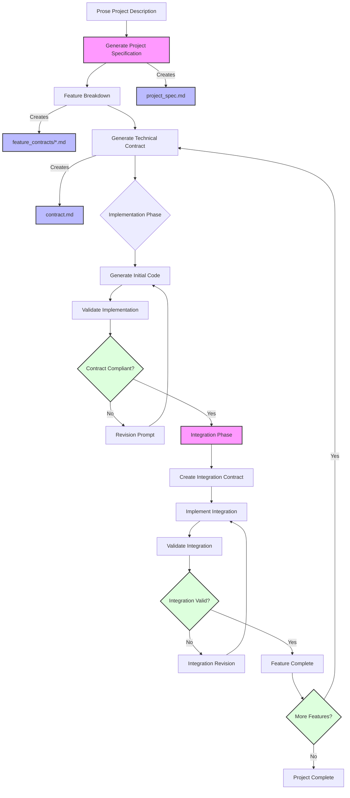

```mermaid
graph TD
    %% Phase 1: Project Initialization
    Start[Prose Project Description] --> ProjectSpec[Generate Project Specification]
    ProjectSpec --> FeatureBreakdown[Feature Breakdown]
    
    %% Documentation Creation
    ProjectSpec --> |Creates|DocProject[project_spec.md]
    FeatureBreakdown --> |Creates|DocFeatures[feature_contracts/*.md]
    
    %% Phase 2: Feature Implementation Loop
    FeatureBreakdown --> ContractGen[Generate Technical Contract]
    ContractGen --> |Creates|DocContract[contract.md]
    
    %% Implementation Subphase
    ContractGen --> ImplPhase{Implementation Phase}
    ImplPhase --> CodeGen[Generate Initial Code]
    CodeGen --> ValidateImpl[Validate Implementation]
    
    %% Validation Loop
    ValidateImpl --> ContractCheck{Contract Compliant?}
    ContractCheck --> |No|RevisionPrompt[Revision Prompt]
    RevisionPrompt --> CodeGen
    ContractCheck --> |Yes|IntegrationPhase[Integration Phase]
    
    %% Phase 3: Integration
    IntegrationPhase --> IntContract[Create Integration Contract]
    IntContract --> IntImplement[Implement Integration]
    IntImplement --> IntValidate[Validate Integration]
    
    %% Integration Validation Loop
    IntValidate --> IntCheck{Integration Valid?}
    IntCheck --> |No|IntRevision[Integration Revision]
    IntRevision --> IntImplement
    IntCheck --> |Yes|FeatureComplete[Feature Complete]
    
    %% Next Feature or Project Completion
    FeatureComplete --> NextFeature{More Features?}
    NextFeature --> |Yes|ContractGen
    NextFeature --> |No|ProjectComplete[Project Complete]
    
    %% Styling
    classDef phase fill:#f9f,stroke:#333,stroke-width:2px
    classDef doc fill:#bbf,stroke:#333,stroke-width:2px
    classDef decision fill:#dfd,stroke:#333,stroke-width:2px
    
    class ProjectSpec,IntegrationPhase phase
    class DocProject,DocFeatures,DocContract doc
    class ContractCheck,IntCheck,NextFeature decision
```

- Pink boxes: Major phases
- Blue boxes: Documentation artifacts
- Green diamonds: Decision points
